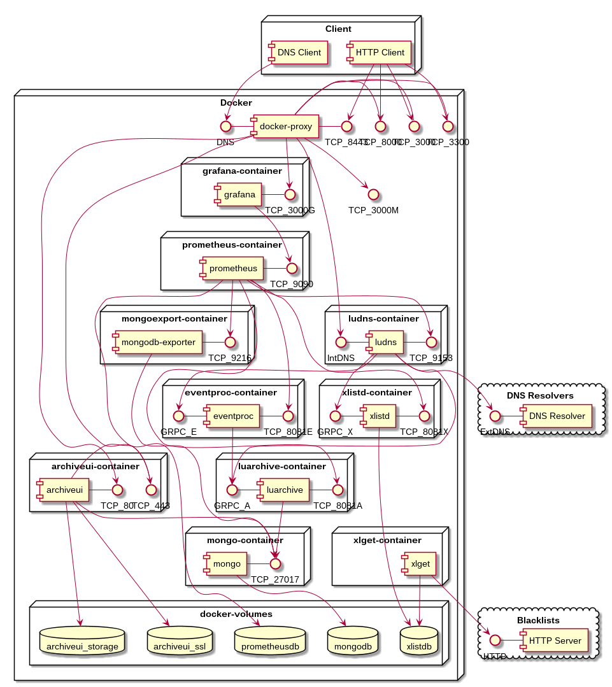

= Advanced DNS sinkhole to block advertising, phishing and malware with metrics

IMPORTANT: Blacklist sources must exist before running service `xlistd`.

For this reason, first run only container `xlget`...

[source,bash]
----
docker-compose up xlget
----

Wait for all the blacklist sources to download, and then press `ctrl+c`.

Now all containers can be started...

[source,bash]
----
docker-compose up -d
----

A full guide (without metrics) can be found at https://luids.io/docs/xlist/es/guides/advanced-dns-sinkhole.html
